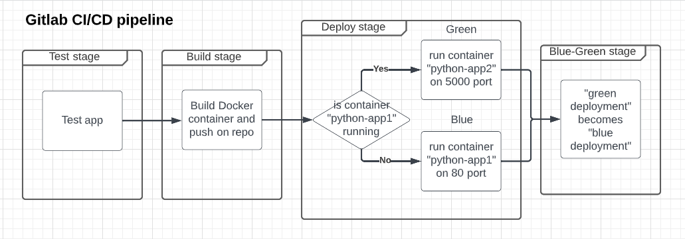
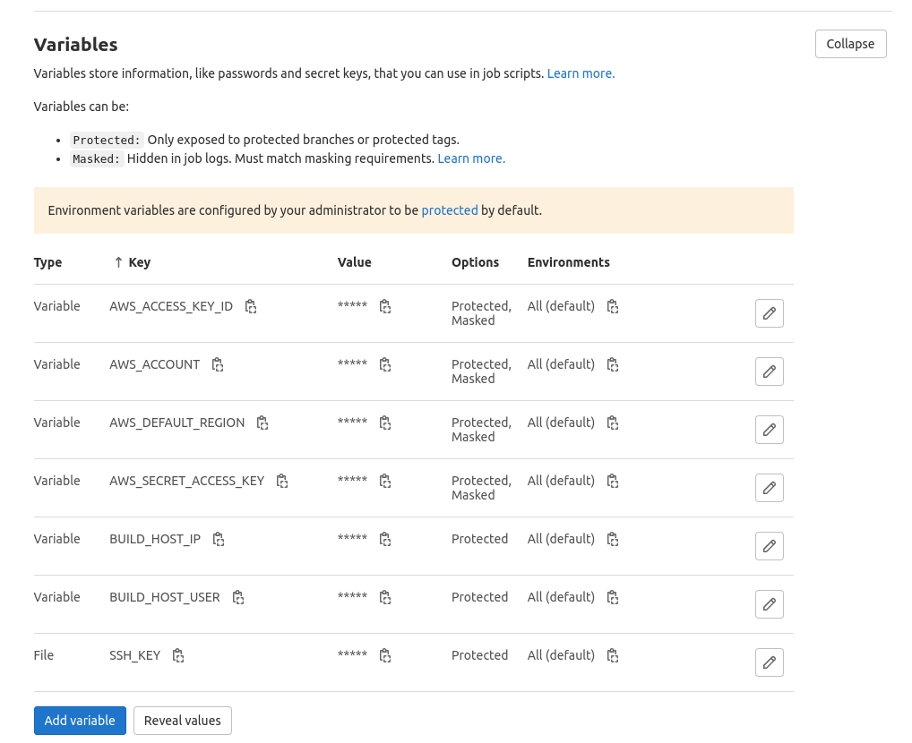

# Python Flask - Demo Web Application

This is a simple Python Flask web application. The app is based on this repo: https://github.com/benc-uk/python-demoapp. The app provides system information and a realtime monitoring screen with dials showing CPU, memory, IO and process information.

The app has been designed with cloud native demos & containers in mind, in order to provide a real working application for deployment, something more than "hello-world" but with the minimum of pre-reqs. It is not intended as a complete example of a fully functioning architecture or complex software design.

Typical uses would be deployment to Kubernetes, demos of Docker, CI/CD (build pipelines are provided), deployment to cloud (AWS) monitoring, auto-scaling

## Screenshot


## Building & Running

### Pre-reqs

- Be using Linux, WSL or MacOS, with bash, make etc
- [Python 3.8+](https://www.python.org/downloads/) - for running locally, linting, running tests etc
- [Docker](https://docs.docker.com/get-docker/) - for running as a container, or image build and push
- [AWS CLI](https://docs.aws.amazon.com/cli/latest/userguide/getting-started-install.html) - for deployment to AWS

Clone the project to any directory where you do development work

```
git clone https://gitlab.com/Andr1500/gitlab-cicd.git
```

### Makefile

A standard GNU Make file is provided to help with running and building locally.

```text
help                 💬 This help message
lint                 🔎 Lint & format, will not fix but sets exit code on error
lint-fix             📜 Lint & format, will try to fix errors and modify code
image                🔨 Build container image from Dockerfile
push                 📤 Push container image to registry
run                  🏃 Run the server locally using Python & Flask
deploy               🚀 Deploy to Azure Web App
undeploy             💀 Remove from Azure
test                 🎯 Unit tests for Flask app
test-report          🎯 Unit tests for Flask app (with report output)
test-api             🚦 Run integration API tests, server must be running
clean                🧹 Clean up project
```

The app runs under Flask and listens on port 5000 by default, this can be changed with the `PORT` environmental variable.

# Creation of Elastic Container Registry and EC2 instance with Terraform

Go to terraform_aws_env_EC2/ and build AWS environment:

set AWS credentials, credentials can be exported as environment variables:
```
export AWS_SECRET_ACCESS_KEY="SECRET_KEY"
export AWS_ACCESS_KEY_ID="ACCES_KEY"
```
run ```terraform init```
if everything is ok, run ```terraform plan``` and ```terraform apply```
when infrastructure wil not be necessary, run ```terraform destroy```

# Gitlab CI/CD pipeline

A working set of CI and CD release Gitlab workflows are provided in .gitlab-ci.yml, automated builds running on Gitlab hosted runners

Gitlab pipeline stages:

- **test** Making test of the app
- **build** Build docker image and push it to private repo.
- **deploy** Deploy app on EC2 instance, first build deploy docker on 80 port as "blue deployment", next build deploy container on 5000 port as "green deployment". "python-app1" is container name for "blue deployment", "python-app2" is container name for "green deployment".
- **blue_green** Manual stage, after verifying that everything is ok with "green deployment" we run this stage and "green deployment" becomes "blue deployment". We stop and delete the container "python-app1" and recreate it based on "green deployment" image. Next we stop and delete "green deployment" container. Next we delete all unused images.



# Gitlab CI/CD Variables

Create AWS IAM user for access to ECR, assign to the user AmazonEC2ContainerRegistryPowerUser policy, copy
access keys and add the keys to Gitlab CI/CD variables.

Add this variables into Settings -> CI/CD -> Variables



### [Gitlab CI/CD pipeline](https://gitlab.com/Andr1500/gitlab-cicd/-/pipelines)
