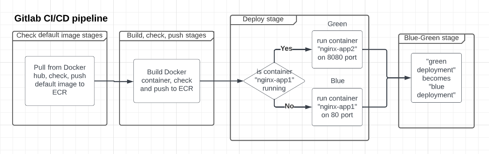
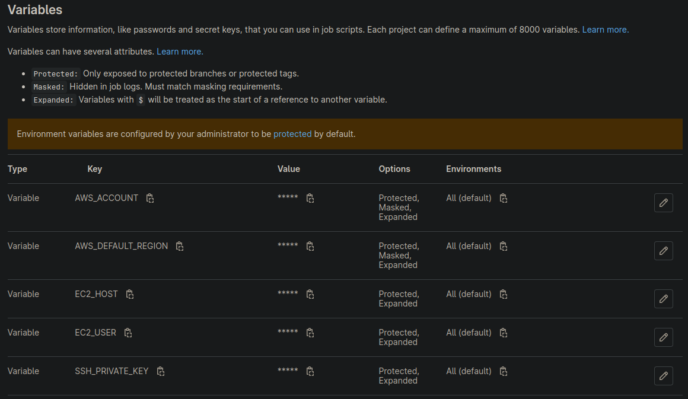
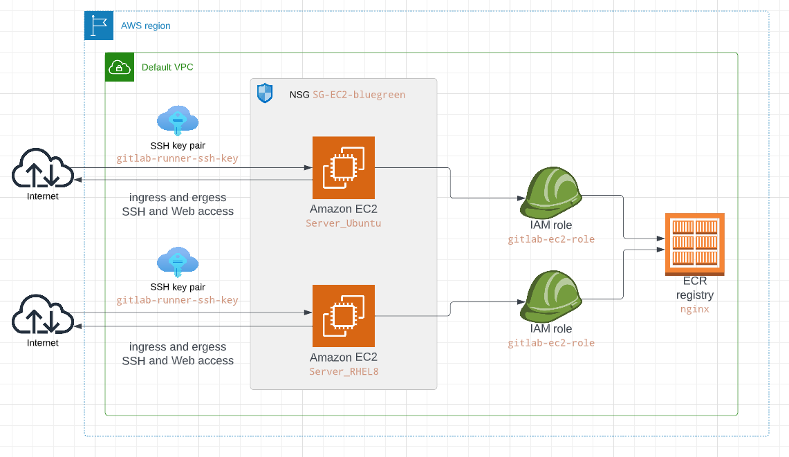

# Simple web application blue-green deployment with GitLab CI/CD pipeline via SSH on an AWS EC2

My post on Medium about the project: https://link.medium.com/PtHs15U5ezb

## Pre-reqs

- A GitLab account with an active project.
- An AWS account with permissions to create resources and an S3 bucket for storing the Terraform backend.
- The Terraform CLI is installed on your local machine.

## Building & Running

Clone the project to any directory where you do development work

```
git clone https://gitlab.com/Andr1500/CICD_BlueGreen_EC2.git
```

## Creation of Elastic Container Registry and EC2 instance (or instances) with Terraform

Go to /environment_aws_EC2, define the S3 bucket in backend.tf, define in variables.tf which instance OS you prefer to use and build AWS environment:

set AWS credentials, credentials can be exported as environment variables:
```
export AWS_SECRET_ACCESS_KEY="SECRET_KEY"
export AWS_ACCESS_KEY_ID="ACCES_KEY"
```
run ```terraform init```
if everything is ok, run ```terraform plan``` and ```terraform apply```
when infrastructure wil not be necessary, run ```terraform destroy```


## Gitlab CI/CD pipeline

A working set of CI and CD release Gitlab workflows are provided in .gitlab-ci.yml, Gitlab stages runs on Gitlab hosted runners with SSH to EC2 instance and make all work on the instance.

Gitlab pipeline stages:

- **check_ecr_default_image** Check if the degault image already exists in ECR repo.
- **docker_pull**, **security_check**, and **docker_push** stages are executable if the default image does not exist in the ECR repo, in other case this stages skipped. In the stage Security_ckeck we use Trivy tool for scaning default docker container in case of vulnerabilities.
- **build_new_image** Build new docker image based on Dockerfile.
- **check_and_push** Check built docker image with Trivy tool and push the image to the ECR repo.
- **deploy** Deploy app on EC2 instance, first build deploy docker on 80 port as "blue deployment", next build deploy container on 8080 port as "green deployment". "nginx-app1" is container name for "blue deployment", "nginx-app2" is container name for "green deployment".
- **blue_green** Manual stage, after verifying that everything is ok with "green deployment" we run this stage and "green deployment" becomes "blue deployment". We stop and delete the container "nginx-app1" and recreate it based on "green deployment" image. Next we stop and delete "green deployment" container. Next we delete all unused images.




## Gitlab CI/CD Variables



Add this variables into Settings -> CI/CD -> Variables



## [Gitlab CI/CD pipeline](https://gitlab.com/Andr1500/CICD_BlueGreen_EC2/-/pipelines)
